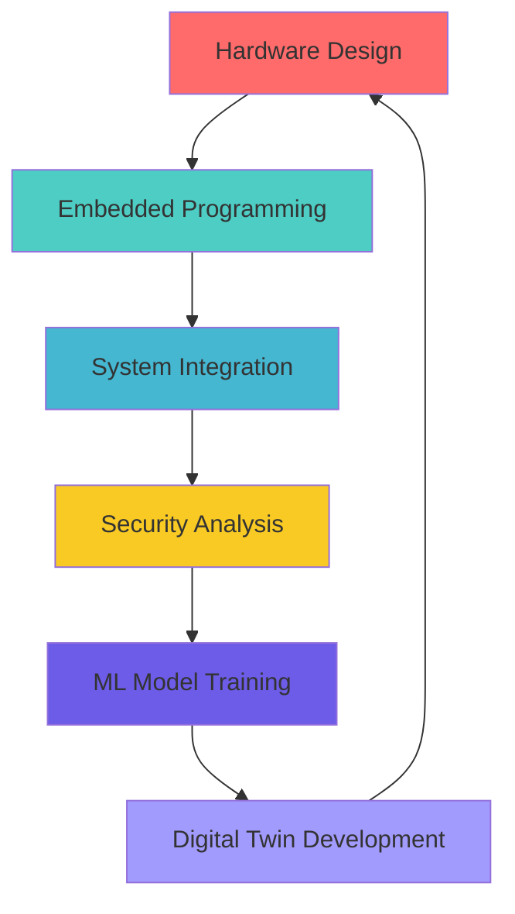

<div align="center">

# 👋 Hi, I'm Arjun Caputo

```ascii
╔══════════════════════════════════════════════════════════════╗
║                  🎯 Aspiring Roboticist & Researcher           ║
║              Hardware • Cybersecurity • Research             ║
╚══════════════════════════════════════════════════════════════╝
```

</div>

---

## 🧬 Research Focus

<table>
<tr>
<td width="33%" align="center">

### 🤖 **Robotics Hardware**
```
┌─────────────────┐
│ Sensors         │
│ Microcontrollers│
│ System Design   │
│ Testing & Valid │
└─────────────────┘
```

</td>
<td width="33%" align="center">

### 🛡️ **Cybersecurity**
```
┌─────────────────┐
│ Embedded Systems│
│ OT/ICS Security │
│ Attack Detection│
└─────────────────┘
```

</td>
<td width="33%" align="center">

### 🔬 **Applied Research**
```
┌─────────────────┐
│ Digital Twins   │
│ Fault Detection │
│ Anomaly Analysis│
└─────────────────┘
```

</td>
</tr>
</table>

> *Working at the intersection of hardware reliability, cybersecurity, and intelligent systems*

---

## 🚀 Featured Projects

<details>
<summary><b>🧠 Digital Twin for SIF-400</b></summary>

```yaml
Repository: arcaputo/SIF-400-digital-twin
Objective: Pure ML approach to distinguish system faults from cyberattacks
Tech Stack: Python, TensorFlow, Digital Twin Architecture
Status: Active Development
```

**Key Innovation:** Created a custom dashboard to model normal system behavior, enabling real-time detection of both mechanical failures and security breaches through deviation analysis.

</details>

<details>
<summary><b>📡 Inertial Measurement Unit Design (In Progress) </b></summary>

```yaml
Repository: arcaputo/imu-project
Objective: Custom microcontroller-based IMU for robotics positioning
Tech Stack: C++, Embedded C, Sensor Fusion Algorithms
Hardware: MPU-6050, STM32, Custom PCB Design
```

**Technical Focus:** High-precision 6-DOF tracking with Kalman filtering for real-time pose estimation in dynamic environments.

</details>

<details>
---

## ⚡ Technology Stack

<div align="center">

### 💻 **Programming & Development**


### 🔧 **Hardware & Embedded**


### 🛠️ **Platforms & Tools**


</div>



---

## 📊 Performance Metrics

<div align="center">


</div>

<div align="center">

[](https://git.io/streak-stats)

</div>

---


</div>

<div align="center">

[](https://arjuncaputo.com)

</div>

---

<div align="center">

